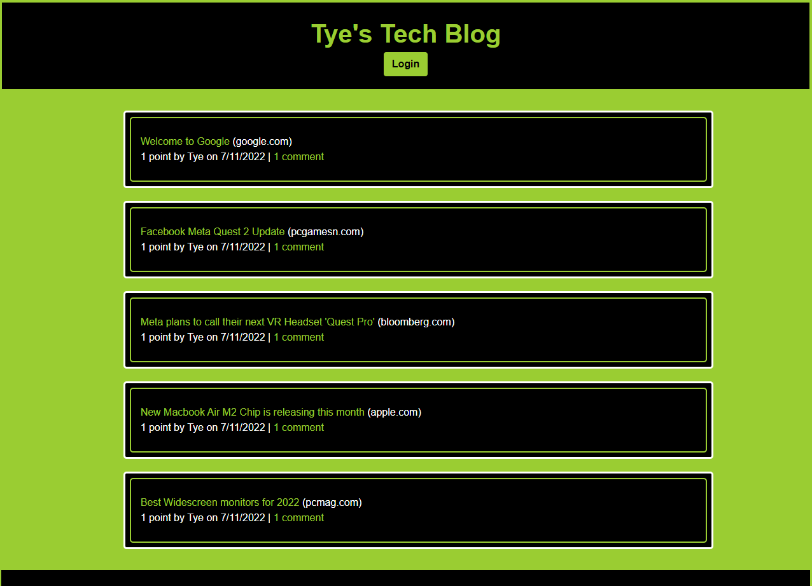
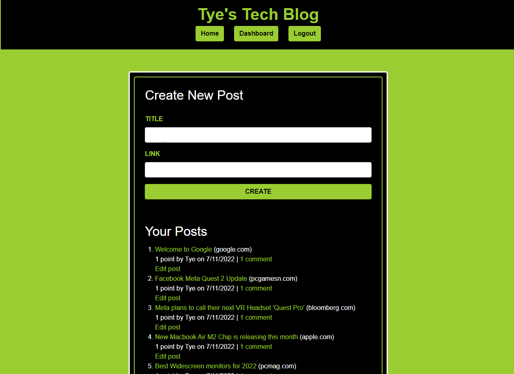

# Tye's Tech Blog

This is a sequelize-powered mysql database that houses my tech blog. To publish, comment, and upvote on posts, you must first establish an account. By hashing the passwords, it employs bcrypt to strengthen the site's security. After logging in, the site will take you to the dashboard where you may write new posts and browse those you've already written. The homepage is where you may browse the most current posts and leave comments. Heroku is hosting this project. You can find the Heroku deployment link under Showcase.

## Installation/Usage

1. Download/clone my repository
2. This app requires node.js to be used.
3. Do `npm install` to install the required npm dependecies
4. Then `npm start` to run locally on your machine

## Showcase

Deployed Link: https://tech-blog-by-tye.herokuapp.com/

Example 1:

Example 2:

## Features

* JavaScript
* Node
* Express
* Sequelize
* MySql
* Handlebars
* NPM
* Bcrypt
* BootStrap
* CSS

## License

Copyright &copy; Tye Stanley. All rights reserved.
  
  Licensed under the [MIT](LICENSE) license.